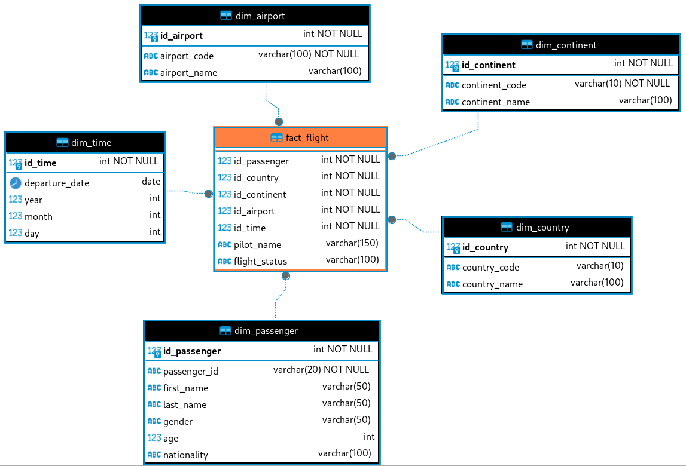

# Diagrama

Se implementará el siguiente diagrama en una base de datos SQL Server. Se cargarán los datos desde un archivo CSV, se importará en la base de datos y luego se hará el proceso ETL.



# Sobre el diagrama

Para el diagrama se utiliza un esquema de estrella, esta formado por una tabla de hechos y 5 dimensiones:

Detalles:

- **dim_time**: Se almacenan todos los valores relacionados a las fechas de los vuelos.
- **dim_passenger**: Se almacena la información de los pasajeros.
- **dim_country**: Se almacena la información de los países.
- **dim_continent**: Se almacenan la información de los continentes.
- **dim_airport**: Se almacena la información de los aereopuertos
- **fact_flight**: Se almacena la información de los vuelos y la relación con sus dimensiones.

# Sobre el proyecto

Versión de `Python` que se utilizará

```shell
$ python --version
Python 3.12.4
```

Versión de `pip` que se utilizará

```shell
$ python3 -m pip --version
pip 23.2.1 from /usr/lib/python3.12/site-packages/pip (python 3.12)
```

Se utilzará un Entorno Virtual para instalar los paquetes necesarios para el proyecto, esto permitirá que se instalen en el ambiente del proyecto y no en el host.

```shell
python3 -m venv virtualEnv
```

Activar el ambiente virtual

```shell
source virtualEnv/bin/activate
```

Para desactivar se puede utilizar

```shell
deactivate
```

Instalar los módulos que se utilizarán, estos ya se encuentran definidos en el archivo `packages.txt`

```shell
pip install -r packages.txt
```

Verificar que los módulos estén instalados

```shell
pip list
```

La instalación también se puede hacer individual. Instalación del módulo `pyodbc` desde la terminal

```shell
pip install pyodbc
```

Es necesario instalar el Driver de la base de datos en el equipo, para este proyecto se utiliza Fedora 39 por lo que se instalará un paquete de RedHat; epecíficamente para RHEL 9. [Install the Microsoft ODBC driver for SQL Server (Linux)](https://learn.microsoft.com/en-us/sql/connect/odbc/linux-mac/installing-the-microsoft-odbc-driver-for-sql-server?view=sql-server-ver16)

```shell
#RHEL 9
curl https://packages.microsoft.com/config/rhel/9/prod.repo | sudo tee /etc/yum.repos.d/mssql-release.repo

sudo yum remove unixODBC-utf16 unixODBC-utf16-devel #to avoid conflicts
sudo ACCEPT_EULA=Y yum install -y msodbcsql18
```

## Módulos
Se utiliza un controlador de base de datos creado para el proyecto. La conexión y definición de las funciones se encuentra en [db.py](db.py)

El detalle de las tablas de la base de datos para el DataWare House se encuentra en [table.py](table.py).

## Pantalla principal
El menú para el manejo de la información se ve de la siguiente forma

```shell
┌─────────────────────────────────────────────┐
│             --- PROCESO ETL ---             │
│ Seleccione una de las siguientes opciones:  │
│	 1. Borrar modelo                         │
│	 2. Crear modelo                          │
│	 3. Extraer información                   │
│	 4. Cargar información                    │
│	 5. Realizar consultas                    │
│	                                          │
│	 0. Salir                                 │
└─────────────────────────────────────────────┘
	Opción:
```
